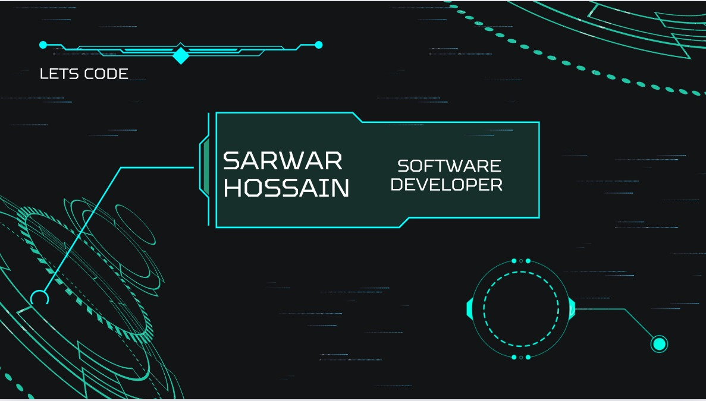

<h1 align="center">
  <!--  -->
     <!-- Sarwar Hossain  < />  -->
     <!-- MERN Stack Developer/&gt;! -->
  <!--  -->
</h1>

<h3 align="center">
<a  href="https://git.io/typing-svg">" alt="Typing role" /></a>
</h3>

 
 

<!-- 
- 🔭 𝙸’𝚖 𝚌𝚞𝚛𝚛𝚎𝚗𝚝𝚕𝚢 𝚠𝚘𝚛𝚔𝚒𝚗𝚐 𝚘𝚗 **Frontend 𝚊𝚗𝚍 Backend 𝚆𝚎𝚋 𝙳𝚎𝚟𝚎𝚕𝚘𝚙𝚖𝚎𝚗𝚝.**
- 🌱 𝙸’𝚖 𝚌𝚞𝚛𝚛𝚎𝚗𝚝𝚕𝚢 𝚕𝚎𝚊𝚛𝚗𝚒𝚗𝚐 **Advance Web Development
  and Backend tech**
- 👯 𝙸’𝚖 𝚕𝚘𝚘𝚔𝚒𝚗𝚐 𝚝𝚘 𝚌𝚘𝚕𝚕𝚊𝚋𝚘𝚛𝚊𝚝𝚎 𝚘𝚗 **Frontend and Backend 𝚆𝚎𝚋 𝙳𝚎𝚟𝚎𝚕𝚘𝚙𝚖𝚎𝚗𝚝.**
- 💬 𝙰𝚜𝚔 𝙼𝚎 𝙰𝚋𝚘𝚞𝚝 𝙰𝚗𝚢𝚝𝚑𝚒𝚗𝚐 [here](https://bd.linkedin.com/in/sarwar-asik) ! 𝙸 𝚊𝚖 𝚑𝚊𝚙𝚙𝚢 𝚝𝚘 𝚑𝚎𝚕𝚙.
- ⚡ 𝙵𝚞𝚗 𝚏𝚊𝚌𝚝 : **𝙱𝚎𝚜𝚝 𝙿𝚊𝚛𝚝 𝙾𝚏 𝚃𝚑𝚎 𝙹𝚘𝚞𝚛𝚗𝚎𝚢 𝙸𝚜 : _𝙸𝚝 𝙴𝚗𝚍𝚜._** -->

 
 

<!-- ## :mailbox: Reach me out -->

<!--
- 🎫 I’m currently learning **Python and Django**

- 💬 Ask me about **React.js, Next.js, Redux, PostgreSQL, and MongoDB**

- 📲 How to reach me **sarwarasik@gmail.com**
- ✅ Reach me via WhatsApp **+8801602819933** -->

 

## <be>
--
</be>

## Reach Me...

## My Technology Skills...

<be>

### ::: Frontend :::

    

</td><td valign="top" width="33%">

### ::: Backend :::

   

### ::: Tools :::

 

<!-- <h1>
  Connect With Me 
  
</h1>

   
  <a href="https://www.linkedin.com/in/sarwar-hossain-a29660257/" target="_blank">
    <code></code>
  </a>
  <a href="https://www.facebook.com/profile.php?id=100087624802395" target="_blank">
    <code></code>
  </a>
 
  <a href="https://twitter.com/sarwar_asik" target="_blank">
    <code></code>
    
  </a>
  <a href="https://discord.com/users/.sarwarhossain">
    <code></code>
  </a>     

 -->
 
  
 

# 📊 GitHub Stats:

  
  

  

  

  

   
  

#

# 🛷 Projects Stats:

### 𝚂𝚑𝚘𝚠ed 𝚜𝚘𝚖𝚎 ❤️ 𝚋𝚢 𝚜𝚝𝚊𝚛𝚛𝚒𝚗𝚐 𝚜𝚘𝚖𝚎 𝚘𝚏 𝚝𝚑𝚎 𝚛𝚎𝚙𝚘𝚜𝚒𝚝𝚘𝚛𝚒𝚎𝚜!

<!--    -->

