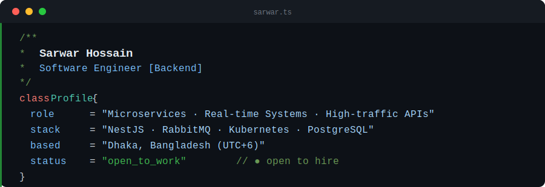
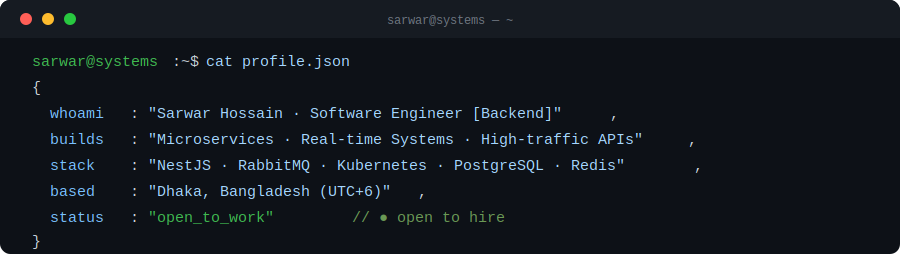
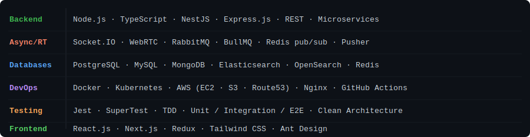

---

### What I ship

Backend engineer specializing in **Node.js microservices**, **real-time systems**, and **high-traffic APIs**.

---

### Stack

### GitHub

&nbsp;

 

---

  Built with intent &nbsp;·&nbsp; Tested with care &nbsp;·&nbsp; Shipped to production

